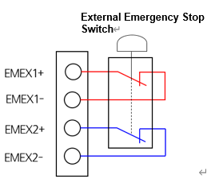

# 4.3.2.5. Connections of the Emergency Stop

(1\)  External Emergency Stop of Contact Input Type 

The external emergency stop (EMEX) is designed in a way that it can be operated regardless of the controller mode (automatic or manual) and is continuously monitored by the BD632 (Safety IO Board). When a safety input is coming in, the motor power will be shut off to put the robot in a safe state. The external emergency stop switch should be connected and used in the form of contact output, as shown in the figure below.

Figure 4.12 Method to Connect the External Emergency Stop Switch to the Terminal Block TBEM

If the external emergency stop is not to be used, connect the terminals of the terminal block TBEM (connect the pins 9-1 and 10-2 of the TBEM connector), as shown below, to disable the input.

_TBEM.png  )

Figure 4.13 Method to Perform When Not Using the External Emergency Stop of Contact Input Type


If an external emergency stop is to be installed and used, the robot should be operated after confirming that the emergency stop operates normally. In addition, check if the emergency stop input is disabled. This is an essential measure that must be taken in advance for the safety of workers.

