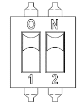

# 4.3.3.4. Setting Devices 


The DIP switch is set to OFF mode when shipped from the factory, and the setting should not be changed arbitrarily by the user.


Table 4-12 Method to Set the DIP Switch (DS1) of the Servo Board (BD640) 

<table>
<thead>
  <tr>
    <th>Switch number</th>
    <th>1</th>
    <th>2</th>
    <th>Mode</th>
  </tr>
</thead>
<tbody>
  <tr>
    <td>Setting when shipped from the factory</td>
    <td>OFF</td>
    <td>OFF</td>
    <td>GET MODE</td>
  </tr>
  <tr>
    <td>When testing</td>
    <td>ON</td>
    <td>OFF</td>
    <td>WAIT MODE</td>
  </tr>
  <tr>
    <td>Switch exterior</td>
    <td colspan="3"></td>
  </tr>
</tbody>
</table>

  


The user cannot change the following items arbitrarily and needs to refer to them only when required to reprogram through FPGA JTAG.


Table 4-13 Description of the Jumper (JP1) of the Servo Board (BD640) 

<table>
<thead>
  <tr>
    <th colspan="2" rowspan="2">Name Contents of the setting</th>
    <th colspan="4">JP1</th>
  </tr>
  <tr>
    <th>1</th>
    <th>2</th>
    <th>3</th>
    <th></th>
  </tr>
</thead>
<tbody>
  <tr>
    <td rowspan="2">Setting of the jumper</td>
    <td>QSPI (flash) boot mode</td>
    <td>⊙</td>
    <td>⊙</td>
    <td></td>
    <td></td>
  </tr>
  <tr>
    <td>JTAG programming mode</td>
    <td></td>
    <td>⊙</td>
    <td>⊙</td>
    <td></td>
  </tr>
  <tr>
    <td>Setting when shipped from the factory</td>
    <td colspan="5">Jumper 1~2, or no connection</td>
  </tr>
</tbody>
</table>
