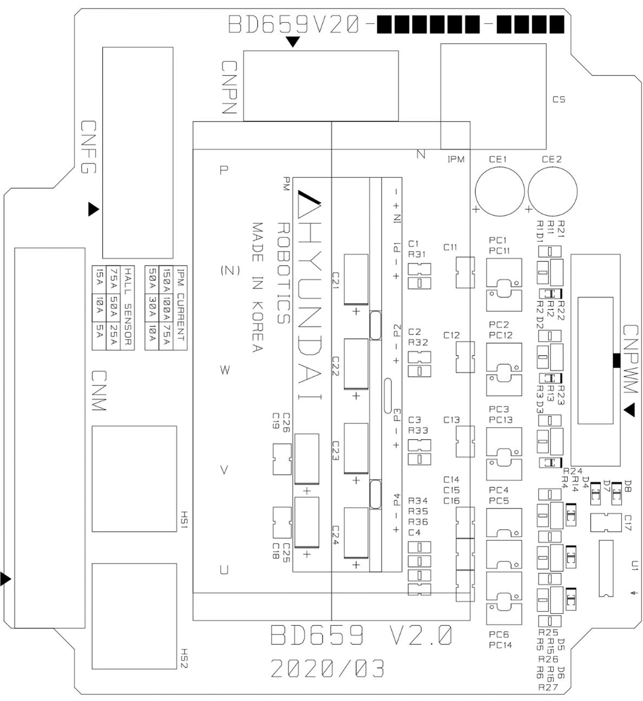

# 4.3.4.5. H6D1Z (Servo Gun Drive Module; Optional)

The drive module performs a power amplification function that allows the current to flow to the individual phases of the motor according to the current command from the servo board. The servo gun drive module can drive one motor of 50A or below and is configured as follows.

Figure 4.25 Parts Placement Diagram of BD659 for H6D1Z  

Table 4-37 Configuration of H6D1Z

<table>
<thead>
  <tr>
    <th colspan="2">Components</th>
    <th>Functions</th>
  </tr>
</thead>
<tbody>
  <tr>
    <td rowspan="3">BD659 (IPM board)</td>
    <td>Logic part</td>
    <td>Converts the PWM signals received from the drive module for the 6 axes into the upper and lower sides drive signals of the IPM, and processes errors</td>
  </tr>
  <tr>
    <td>Gate power module</td>
    <td>Generates the gate power</td>
  </tr>
  <tr>
    <td>Current detection part</td>
    <td>Detects the current that flows through the motor</td>
  </tr>
  <tr>
    <td rowspan="2">Other parts</td>
    <td>Heat sink</td>
    <td>Releases the heat generated from IPM to the outside</td>
  </tr>
  <tr>
    <td>IPM</td>
    <td>A switching device of 50A</td>
  </tr>
</tbody>
</table>

Table 4-38 Description of the Connectors of H6D1Z

<table>
<thead>
  <tr>
    <th>Name</th>
    <th>Usage</th>
    <th>Connection of external devices</th>
  </tr>
</thead>
<tbody>
  <tr>
    <td>CNPWM</td>
    <td>PWM signal and error signal</td>
    <td>CNPWM7 or CNPWM8 of the drive module (BD652 or BD654) for the 6 axes</td>
  </tr>
  <tr>
    <td>CNM</td>
    <td>Motor drive output</td>
    <td>AMC1 or AMC2</td>
  </tr>
  <tr>
    <td>CNFG</td>
    <td>Frame ground for the motor</td>
    <td>AMC1 or AMC2</td>
  </tr>
  <tr>
    <td>CNPN</td>
    <td>Drive direct current power input</td>
    <td>CNPN7 or CNPN8 of the drive module (BD651 or BD653) for the 6 axes</td>
  </tr>
</tbody>
</table>
